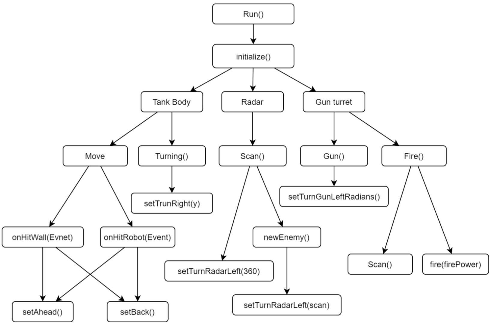
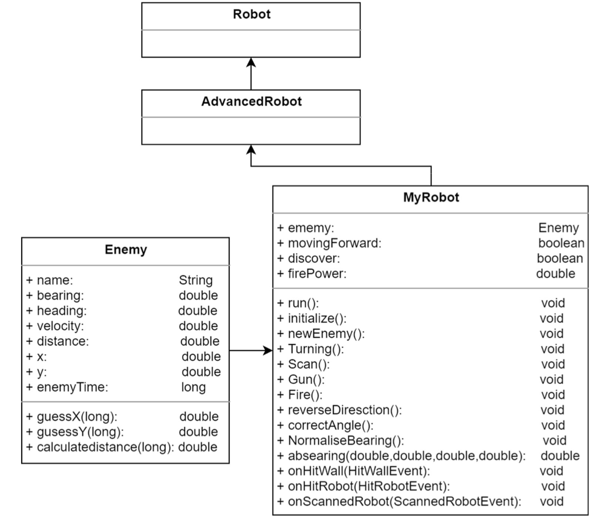
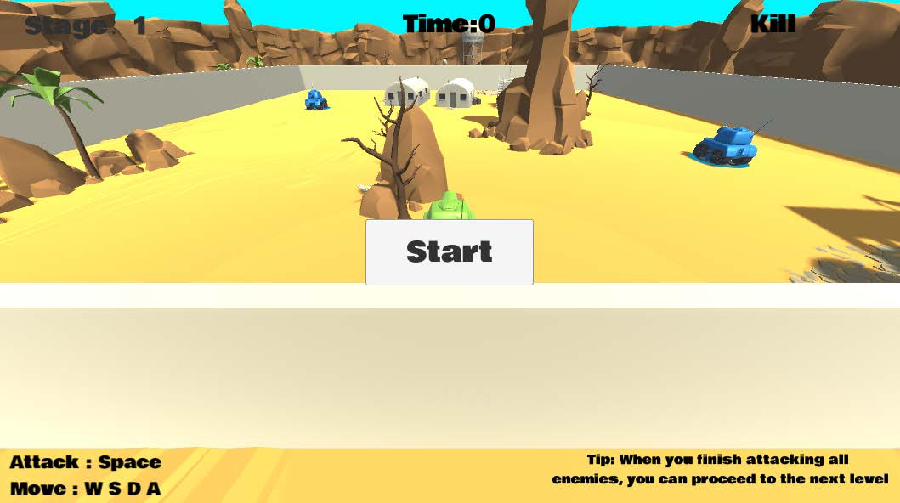
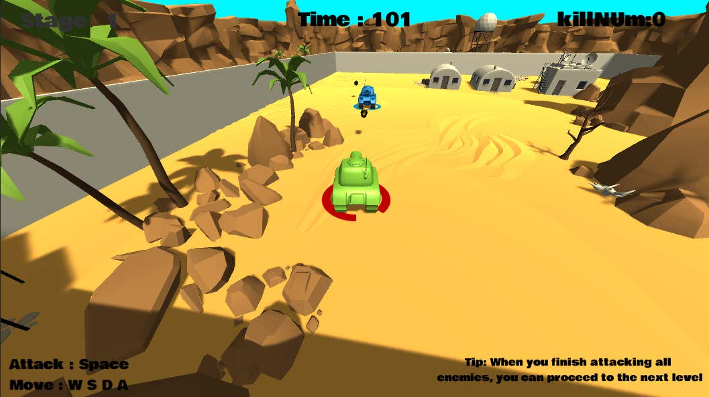
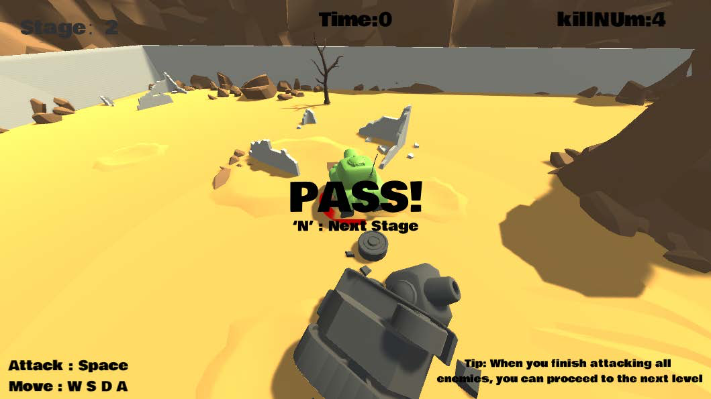
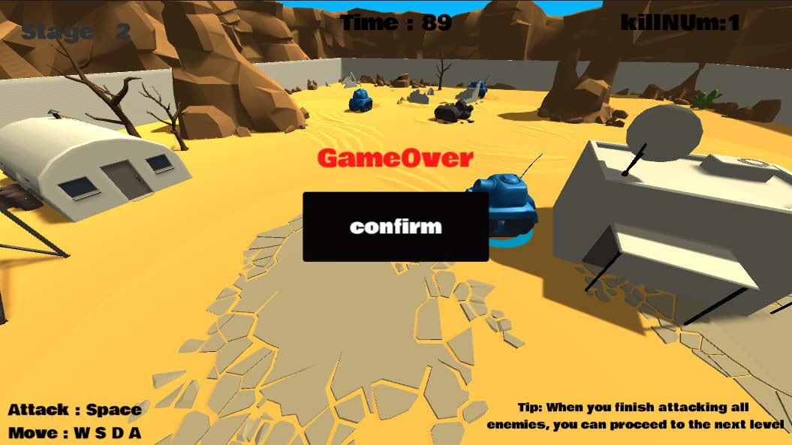

# Game Design
## Robocode + JAVA

### Environment details and how to run the program

System: Windows 10 Professional 20H2
Software version:
 -	Robocode 1.9.4.1
 -	Java 15 SDK for ‘Robots’ module

How to run program: (Download the ZIP file and unzip it)

1. Robocode import robot(recommend): Robot -> Import robot or team -> Select .jar -> New Battle

2. Robot Editor: New Robot -> Copy the code in and compile -> New Battle

### Control Model Describe : Behavior Tree

The behavior tree is a tree structure containing logical nodes and behavior nodes. Each time a behavior needs to be found, the root node of the tree is started, and each node is traversed to find the first behavior that matches the current data.

Advantages:

- Referencing logical nodes, fewer conversion bars(Clear logic)
- Easy to extend AI behavior
- Behavior can be reused

Structure:

1. Root Node
2. Logical Node
3. Behavior Node


## Description AI design

The robot consists of three parts, namely the body, turret, and radar, all three of which can be rotated independently and can separately control some controls, such as forward distance, radar angle, firing, etc. Therefore, we roughly divide the logic into three logical.

**Behavior Tree diagram:**


**Tank Body:**

Responsible for movement, quote mathematical formula, make the tank move trajectory like a snake crawl sway, make the enemy difficult to predict the movement trajectory of this tank, and at the same time set the robot to detect the impact (hit the wall, hit the enemy) and immediately reverse the direction of movement. Greatly improve the survival rate of the tank in the battlefield

**Radar:**

Responsible for scanning the battlefield for enemies, rotating 360 degrees if no enemy is scanned, until the enemy is scanned then locking the enemy direction, returning information about the enemy, position, direction of movement, speed, etc. Under the turret part of the behavior will call the enemy information.

**Gun turret:**

Responsible for rotating the muzzle and firing, the muzzle part calls radar to scan the information of the enemy, calculate and predict the trajectory of that enemy's movement through the formula, and set the angle of the muzzle to hit the advance. The firing part adjusts the fire size according to the local distance. Achieve the maximum use of firepower.

## Implementation    
**UML diagram:**


**Class Description**

MyRobot Class:

Each of the six different behaviors is controlled by multiple methods.

`Turning()，Scan()，Gun()` and `Fire()` are called sequentially in `run()`, and each method has a different behavior pattern inside to implement the tank behavior transition.

Code part:
```
public void run(){
	 initialize(); 
	 newEnemy(); 
	 while(true){ 
			Turning(); 
			Scan(); 
			Gun(); 
			Fire(); 
			execute(); 
}}
```

Enemy Class:

Record enemy information, three methods for calculating and predicting X,Y values and distance after enemy movement

Code part:
```
guessX(long time)
guessY(long time)
calculatedistance(long time)
```

## Unity + C#


## Environment details and how to run the program

**System:**

- Windows 10 Professional 20H2

**Software version:**

- Unity 20.20.3.3f1c1
- Visual Studio Community 2019 16.9.3
	- MSVC v142 – VC 2019 C++ x64/x86
	- Windows 10 SDK (10.0.18352.0)

**How to run program:**

Three ways to run program: (Download the ZIP file and unzip it)

1. Run execution (recommend): Find the folder with the name EXE, click in and run the program with the battleLite.exe suffix

2. Unity Hub: Add and select the Unity Project -> battleLite folder

3. Create a new project in Unity, import the battle.unitypackage suffix file into the new project, and click Play to run the program

## Describe : Tank battle mini game

**Modelling environment and Physics:**

Game scenes and models are built with 3D models, each item comes with ambient light, shadows and textures.

**Physics:**

All items have object collision detection. If a tank hits an object or a wall in the scene, it will not pass. The fired bullets will explode and disappear when they hit any object. When the enemy or player tank life goes to zero, it will be removed from the game. It is restored when respawn starts

**Keyboard interaction:**

The game allows the player to control his tank in third person view and to attack the tank enemies. WASD and arrow keys are to move, space is to attack.

**Gameplay:**

The game has a total of three card stages, each stage scene is different, the number of enemies is also different. The further you go, the harder it gets. 

**Extra:**

The UI interface has the current number of stages, the remaining time, and the number of enemies killed. Players need to pass the stage within a certain time. The game adds background music, firing sounds and bullet, etc.

**Game process description:**

How to start the game: In the game interface, click the “Start” button to start


When the game is played, the player needs to control the tank action by using the arrow keys, and press space to fire the shells. If you enter the enemy attack range, you will be attacked by the enemy tank.


If you destroy all the enemy tanks in the change scenario, the pass screen will pop up, press the ‘N’ button to enter the next scene


When the player dies, then the death screen pops up and there is a confirmation button to click to restart the game.



## Explaining how the functionalities and additional requirements are implemented 
Scripts: (C#) 
`GameManager.cs`

Game scene switch, death interface, UI interface scene number, kill enemy number, time

`CameraFlow.cs`

Third-person camera following the player

`Tank_Attack.cs`

Tank attack script that instantiates a bullet model at the firing port.

`Tank_health.cs`

Tank health script, show blood (HP 100), detect bullet impact then deduct blood, damage range 15-25, destroy the object if life is less than or equal to 0

`Tank_Movement.cs`

Tank movement script, the player is controlled by the keyboard to move, the enemy tank is automatically patrolling, when the distance between the enemy and the player is less than or equal to 15f, then stop patrolling and towards the player, call Tank_Attack script to launch an attack

`Shell.cs`

Shell script, add sound effects, object collision detection, destroy the Shell Object if it hits an item

`DestroyForTime.cs`

Shell flight time, more than 1.5 seconds to destroy the Shell.
